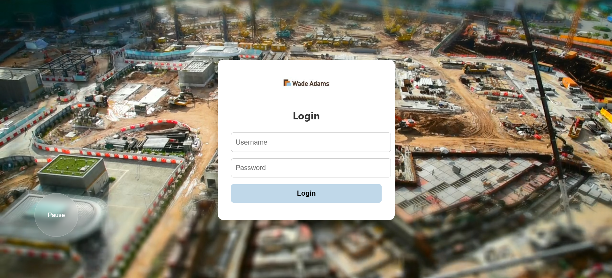
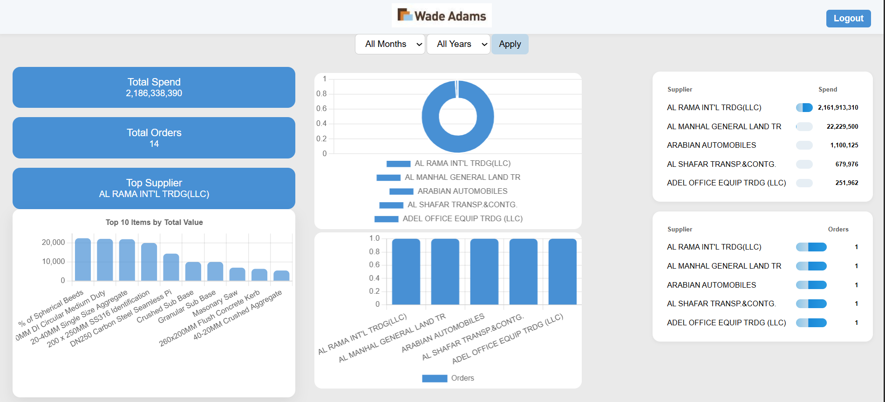

# Real Time Dashboard

A responsive, interactive dashboard for managing supplier data and tracking orders. Built with PHP, MySQL, HTML, CSS, and JavaScript, this dashboard provides a clean interface for data visualization, user authentication, and database management.

---

## 🔹 Features

- **User Authentication**: Secure login system for authorized access.
- **Data Management**: Connects to MySQL to fetch and display supplier orders.
- **Responsive Design**: Works seamlessly on desktop, tablet, and mobile.
- **Visual Insights**: Built-in charts for quick understanding of supplier metrics.
- **Modular Structure**: Organized directories for assets, scripts, and database files.
- **Easy Integration**: Ready to connect to live MySQL databases with minimal configuration.

---

## 🛠️ Tech Stack

| Layer             | Technologies |
|------------------|--------------|
| Frontend         | HTML, CSS, JavaScript, Bootstrap |
| Backend          | PHP |
| Database         | MySQL |
| Charts & Graphs  | Chart.js |
| Version Control  | Git & GitHub |

---

📂 Project Structure
wadeadamdb/
│
├─ assets/           # Images, logos, icons
├─ old data/         # Previous project versions
├─ main/             # Main database files
├─ dashboard.html    # Main dashboard UI
├─ login.html        # Login page
├─ fetch.php         # Fetch and display data from MySQL
├─ style.css         # Styles for the dashboard
└─ README.md         # Project documentation

---

## 🖼️ Images

-  
- 
- 

---

## 🚀 Getting Started

1. **Clone the repository**

``bash
git clone https://github.com/chrisambatti/Dashboard.git
cd Dashboard

## Import mydatabase.sql into your local MySQL server.
mysql -u root -p < main/mydatabase.sql

## Configure PHP

Ensure you have XAMPP/WAMP installed and running.

Place the project folder in the htdocs directory.

## Run the Dashboard

Open your browser and navigate to:

http://localhost/wadeadamdb/dashboard.html

## ⚡ Usage

Add new suppliers via MySQL directly.

Visualize supplier orders and rankings in real-time.

Expand the dashboard with custom charts or filters as needed.

## 🤝 Contributing

Fork the repository

Create a branch: git checkout -b feature/YourFeature

Commit your changes: git commit -m "Add some feature"

Push to the branch: git push origin feature/YourFeature

Open a Pull Request

## 💬 Contact

Christopher Philip Ambatti

GitHub: chrisambatti

Email: chrisambatti123@gmail.com
